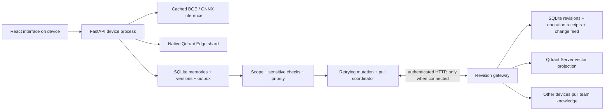

# EdgeAtlas architecture

## System topology

The model, Edge shard and device database are all local. Query text is not sent to the gateway. Shared knowledge is a selectively synchronized replica, not a prerequisite for retrieval.

## Local writes and index durability

Each memory has a UUID, local version, last acknowledged cloud revision, source, category/site/tags, sharing scope, priority and optional expiry time. Saving performs local embedding first, then atomically saves the document, appends its revision, records a projection marker and updates the outbound snapshot if allowed. Edge indexing uses the persisted vector and built-in BM25 document vector. The shard is flushed before clearing the marker.

If the process stops after the SQLite commit but before indexing, the note is still durable. Startup replays authoritative documents. Before search, outstanding projection markers are repaired, including failures that occur without a process restart. An archive deletes the vector projection, while the authoritative document/history remain recoverable.

The device serializes writes, projection work and synchronization under an RLock. This is an intentional single-process design. Neither SQLite nor the Edge shard is treated as a distributed multi-writer store.

## Search

Dense vectors use `BAAI/bge-small-en-v1.5` (384 dimensions) on the ONNX CPU provider with two inference threads. Documents use title + body + tags. Queries use the model's query embedding path. Qdrant Edge's native BM25 builds sparse document/query vectors; its IDF modifier incorporates corpus frequencies.

Semantic mode queries the dense index. Keyword mode queries BM25. Hybrid mode runs both prefetches and fuses them using reciprocal rank fusion with k=60. Category, site and requested visibility filters apply in the shard before candidates are ranked. The API joins result IDs to authoritative documents and returns source excerpts. Duration includes query embedding and native retrieval, not full browser rendering time.

## Routing

1. Explicit device-only scope prevents an outbound copy.
2. Team scope is still blocked by configured email, credential, phone and private-identifier patterns in title/body/tags/site/source.
3. Eligible notes are ordered critical, high, normal, low. Metered mode defers entries below a configurable threshold.
4. A previously shared note that becomes private is represented by a content-free tombstone. Withdrawals sort first and bypass metered thresholds.
5. Optional retention reversibly archives expired notes and withdraws an existing cloud copy.

The gateway independently validates the scope and sensitive patterns. This is a rule-based, inspectable classification system rather than an opaque model claim. These rules do not establish compliance or detect every possible sensitive statement.

## Mutations, acknowledgements and retries

The device outbox stores one latest unsent snapshot per memory, including a UUID operation ID, base cloud revision, complete allowed document/vector, retry count/time and status. Offline edits coalesce while retaining the last known cloud base. The operation ID and snapshot remain identical across uncertain retries.

The gateway compares the base revision with its authoritative revision. A match commits the new document, vector, operation receipt and ordered change event in one SQLite transaction. It projects the document into the real Qdrant Server before confirming the request. If that projection fails, the durable marker remains. Retrying the same operation retries projection and returns the original receipt, without adding a second revision.

Reusing an operation ID with different content is rejected. A device removes its queued snapshot only after a successful acknowledgement. On HTTP failure, retry metadata persists with bounded exponential backoff (up to 300 seconds). A manual Sync now can bypass backoff but cannot bypass privacy or conflict rules. Each sync sends at most 20 pending records and reads at most five pages of 100 changes.

## Pulls and conflict resolution

The gateway change feed is ordered by a monotonic SQLite sequence. A device persists the new cursor only after handling the entire received page. Already acknowledged revisions are skipped. New server memories are embedded and indexed locally. A server update targeting a locally pending edit creates a durable conflict, preserving the remote document alongside the local one.

There are three resolutions:

| Resolution | Result |
|---|---|
| Keep device | Adopt the latest known remote base and queue a fresh local operation |
| Use cloud | Replace local state with the remote document and clear pending changes |
| Merge notes | Persist the combined body, re-embed locally, re-run routing, and queue a fresh operation if allowed |

A further cloud update before resolution is sent can produce another revision conflict, rather than an unguarded overwrite. Edits and archives are blocked while a conflict is unresolved. Cloud tombstones do not erase a device's private reclassified body.

## Security and operating assumptions

The default demo binds all three APIs to loopback. A custom edge access token is required for a non-loopback device bind, and a custom synchronization token for a non-loopback gateway bind. The local API checks frontend origins and protects all API routes except health when a token is configured. The gateway requires its synchronization token, rejects browser-origin requests, and keeps Qdrant credentials server-side.

The UI's control-room editor is an authenticated device-side proxy to the gateway. Its edits use cloud revisions and the same validation rules; it cannot upload private content to the shared store. It is a convenient single-workspace collaboration demonstration, not a separate multi-user authorization system.

For a remote system, put the gateway behind HTTPS, protect Qdrant on a private network, introduce per-device/per-workspace permissions, centralize revision coordination, encrypt disks and implement backup/erasure policy. The existing checks are a working local/demo boundary, not a complete enterprise security program.

## Storage boundaries

- `data/edge/device.sqlite`: authoritative local documents, vectors, history, outbox, conflicts, projection markers, policy and activity.
- `data/edge/shard/`: native Qdrant Edge projection, WAL and indexes.
- `data/models/`: locally cached ONNX model/tokenizer, prepared once.
- `data/cloud/cloud.sqlite`: authoritative central revisions, idempotency receipts, projection state, change feed.
- `data/qdrant/`: actual Qdrant Server storage.

The centralized gateway is another durable participant. Synchronizing to a vector server alone would not provide the revision coordination needed to safely merge disconnected edits. That is why the application has an explicit gateway rather than blind dual writes.
